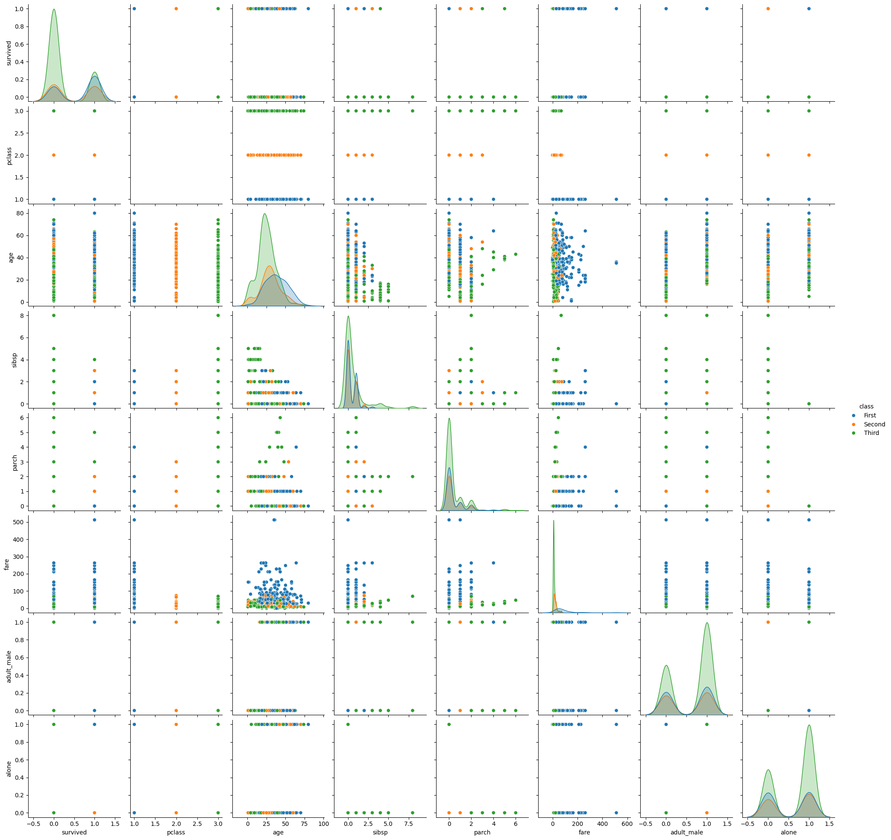

# 🔍 Análise de Correlação de Dados com Pairplot usando Seaborn


[](https://www.python.org/downloads/release/python-3120/)
[](https://seaborn.pydata.org/)
[](https://pandas.pydata.org/)


## 📊 Descrição
Este projeto exemplifica o uso de **Python** e **Seaborn** para análise de correlação de dados utilizando o dataset `titanic` disponível no `seaborn`. Através do uso de pairplots, podemos visualizar as relações entre diferentes variáveis do dataset.
Utiliza Python juntamente com as bibliotecas Pandas e Seaborn para explorar, analisar e visualizar dados do famoso conjunto de dados do Titanic.
O objetivo deste projeto é fornecer uma análise visual dos dados do Titanic, focando nas relações entre diferentes variáveis como classe, cidade de embarque, e taxa de sobrevivência. Utilizamos Seaborn para criar gráficos de pares que ajudam a identificar correlações e distribuições de forma intuitiva e visual.

## 🛠️ Funcionalidades

- **Carregamento de Dados**: Carrega dados diretamente dentro do ambiente Python usando Seaborn.
- **Exploração de Dados**: Explora diferentes variáveis como `embark_town`, `class`, e `survived`.
- **Visualizações Estatísticas**: Utiliza gráficos de pares para visualizar as relações e distribuições das variáveis.


## 🚀 Explicação do Código


### Carregamento dos Dados
```python
import seaborn as sns
import pandas as pd

# Carregando o dataset 'titanic' do seaborn
titanic = sns.load_dataset('titanic')
```
Carregamos o dataset `titanic` que vem pré-carregado no `seaborn`.

### Exibição dos Primeiros Dados
```python
# Exibindo as primeiras linhas do dataset
print(titanic.head())
```
Utilizamos `head()` para visualizar as primeiras linhas do dataset.

### Análise de Dados Nulos
```python
# Analisando os dados faltantes
print(titanic.isnull().sum())
```
Verificamos a presença de valores nulos no dataset.

### Descrição Estatística
```python
# Descrição estatística dos dados
print(titanic.describe())
```
Obtemos uma descrição estatística básica das variáveis numéricas no dataset.

### Criação do Pairplot
```python
import seaborn as sns

# Criando o pairplot do dataset Titanic
sns.pairplot(titanic, hue='class')
```
Criamos um pairplot para visualizar as relações entre as variáveis numéricas, colorindo os pontos de acordo com a classe dos passageiros.


## 🧱 Fundamentos do Python
### Bibliotecas
- **Pandas**: Biblioteca poderosa para manipulação de dados em Python.
- **Seaborn**: Biblioteca de visualização de dados que fornece uma interface de alto nível para desenhar gráficos estatísticos atraentes e informativos.

### Funções e Métodos
- **`pd.read_csv()`**: Lê um arquivo CSV e o carrega em um DataFrame.
- **`DataFrame.head()`**: Exibe as primeiras linhas do DataFrame.
- **`DataFrame.isnull().sum()`**: Verifica a presença de valores nulos no DataFrame.
- **`DataFrame.describe()`**: Gera estatísticas descritivas do DataFrame.
- **`sns.pairplot()`**: Cria uma matriz de gráficos de dispersão de pares de variáveis no DataFrame.

## Visualização do Gráfico


---


[](https://opensource.org/licenses/MIT)
[](https://github.com/PH3-Digital/ADA-Coders-2024/tree/main/Desafio-CorrelacaoDados-Pairplot-Seaborn)


### Detalhamento dos Fundamentos do Python

- **Importações**: `import` é usado para adicionar módulos externos ao nosso script.
- **Pandas**: Utilizado para manipulação e análise de dados. A função `pd.read_csv()` é comumente usada para carregar dados de arquivos CSV, mas aqui utilizamos `sns.load_dataset()` para carregar dados diretamente via Seaborn.
- **Seaborn**: Uma biblioteca de visualização de dados baseada em Matplotlib que proporciona uma interface de alto nível para desenhar gráficos estatísticos atrativos.
- **DataFrames**: Estruturas de dados bidimensionais onde os dados são alinhados de forma tabular em linhas e colunas, facilitando a manipulação.
- **Métodos `.value_counts()`**: Retorna uma série contendo contagens de valores únicos, útil para obter uma contagem de frequência de informações categóricas.
- **`sns.pairplot()`**: Um método de Seaborn que cria gráficos entre pares de colunas num DataFrame para explorar as relações entre elas.

## Contribua!

Sinta-se livre para `fork` este repositório e contribuir com melhorias. Todas as sugestões e contribuições são bem-vindas!

[](https://github.com/PH3-Digital/ADA-Coders-2024/tree/main/Desafio-CorrelacaoDados-Pairplot-Seaborn)

## Licença

Este projeto está licenciado sob a Licença MIT - veja o arquivo [LICENSE.md](LICENSE.md) para detalhes.
```

Este `README.md` incorpora badges informativos, uma descrição clara do projeto, funcionalidades, visualizações gráficas, e uma explicação detalhada do código e dos fundamentos de Python usados.