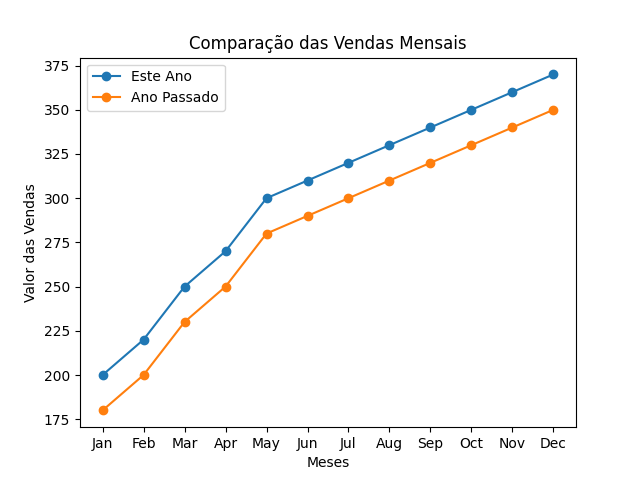

# 📊 Projeto - Usando Matplotlib para criar gráficos e comparar dados


## 📚 Descrição
# Análise de Vendas de Artigos para Dança

Este projeto visa analisar a evolução das vendas de uma loja de artigos para dança, comparando os valores mês a mês com as vendas do ano anterior. Utilizaremos a biblioteca `matplotlib` para criar um gráfico de linha que ilustrará as tendências e variações nas vendas ao longo dos meses.

## Descrição

O projeto inclui:
- Criação de um gráfico de linha para visualizar a evolução das vendas.
- Comparação dos dados de vendas entre dois anos consecutivos.
- Explicação detalhada das funções e métodos usados para gerar o gráfico.

## Funcionalidades

- **Gráfico de Linha**: Visualiza a evolução das vendas mês a mês.
- **Comparação Anual**: Compara as vendas de cada mês entre dois anos diferentes.
- **Interatividade**: Permite identificar facilmente tendências e variações nas vendas.

## Explicação do Código

A seguir, detalhamos o código usado para criar o gráfico de linha e comparamos as vendas mês a mês entre dois anos.

### Importando a Biblioteca Necessária

```python
import matplotlib.pyplot as plt
```
Importamos a biblioteca `matplotlib.pyplot`, que é usada para criar visualizações estáticas, animadas e interativas em Python.

### Preparando os Dados

```python
meses = ['Jan', 'Feb', 'Mar', 'Apr', 'May', 'Jun', 'Jul', 'Aug', 'Sep', 'Oct', 'Nov', 'Dec']
dados_este_ano = [1000, 1500, 2000, 2500, 1800, 2200, 2400, 2100, 2300, 2600, 2700, 3000]
dados_ano_passado = [800, 1300, 1800, 2200, 1600, 2000, 2100, 1900, 2000, 2400, 2500, 2800]
```
Definimos duas listas: `meses`, contendo os nomes dos meses, e `dados_este_ano` e `dados_ano_passado`, contendo os valores das vendas de cada mês para os dois anos que estamos comparando.

### Criando o Gráfico de Linha

```python
plt.plot(meses, dados_este_ano, label='Este Ano', marker='o')
plt.plot(meses, dados_ano_passado, label='Ano Passado', marker='o')
```
Usamos a função `plt.plot` para criar duas linhas, uma para cada ano. O parâmetro `label` é usado para identificar cada linha na legenda do gráfico, e `marker='o'` adiciona um marcador circular em cada ponto de dados.

### Adicionando Título e Legendas

```python
plt.title('Comparação de Vendas Mês a Mês')
plt.xlabel('Meses')
plt.ylabel('Vendas Totais')
plt.legend()
```
- `plt.title` define o título do gráfico.
- `plt.xlabel` e `plt.ylabel` definem os rótulos dos eixos X e Y, respectivamente.
- `plt.legend` exibe a legenda que diferencia as duas linhas.

### Exibindo o Gráfico

```python
plt.show()
```
A função `plt.show` exibe o gráfico na tela.

### Código Completo

```python
import matplotlib.pyplot as plt

# Dados fictícios para as vendas mês a mês
meses = ['Jan', 'Feb', 'Mar', 'Apr', 'May', 'Jun', 'Jul', 'Aug', 'Sep', 'Oct', 'Nov', 'Dec']
dados_este_ano = [1000, 1500, 2000, 2500, 1800, 2200, 2400, 2100, 2300, 2600, 2700, 3000]
dados_ano_passado = [800, 1300, 1800, 2200, 1600, 2000, 2100, 1900, 2000, 2400, 2500, 2800]

# Criando o gráfico de linha
plt.plot(meses, dados_este_ano, label='Este Ano', marker='o')
plt.plot(meses, dados_ano_passado, label='Ano Passado', marker='o')

# Adicionando título e legendas
plt.title('Comparação de Vendas Mês a Mês')
plt.xlabel('Meses')
plt.ylabel('Vendas Totais')
plt.legend()

# Salvando o gráfico como imagem
plt.savefig('vendas_comparacao.png')

# Exibindo o gráfico
plt.show()
```
## Resultado


---

## Fundamentos do Python Aprendidos

- **Biblioteca `matplotlib`**: Usada para criar gráficos e visualizações.
- **Listas**: Estrutura de dados para armazenar sequências de valores.
- **Função `plt.plot`**: Cria gráficos de linha.
- **Função `plt.title`**: Define o título do gráfico.
- **Função `plt.xlabel` e `plt.ylabel`**: Definem os rótulos dos eixos.
- **Função `plt.legend`**: Adiciona uma legenda ao gráfico.
- **Função `plt.show`**: Exibe o gráfico na tela.

Com esta explicação e o código fornecido, você pode entender e replicar a análise de dados de vendas utilizando gráficos de linha para comparar tendências anuais.

---


---

## 📈 Estatísticas do Repositório


---
---

Este projeto é mantido por [PH3-Digital](https://github.com/PH3-Digital). Contribuições são bem-vindas!