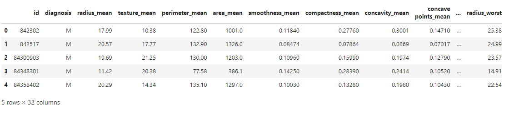
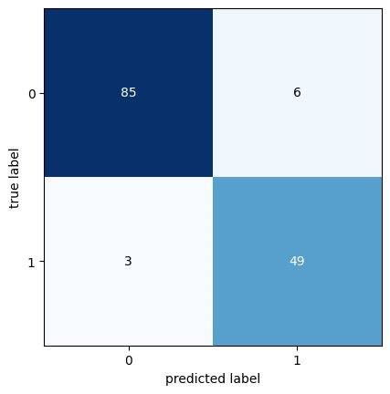
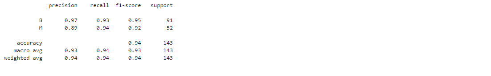

# Projeto de Relatório de Classificação e Predição de Diagnóstico de Câncer de Mama com Regressão Logística


## Descrição

Este projeto utiliza a técnica de Regressão Logística para prever o diagnóstico de câncer de mama (maligno ou benigno) utilizando o dataset `breast-cancer.csv`. O dataset contém diversas características de diagnósticos vários pacientes, e o objetivo é treinar um modelo que possa fazer previsões precisas com base nessas características. 

### Funcionalidades

1. **Carregamento e Visualização de Dados**: Leitura do dataset e visualização das primeiras linhas.
2. **Pré-processamento dos Dados**: Separação das características (features) e da variável alvo (target).
3. **Divisão dos Dados**: Divisão do dataset em conjuntos de treino e teste.
4. **Treinamento do Modelo**: Treinamento de um modelo de Regressão Logística.
5. **Previsão e Avaliação**: Realização de previsões e avaliação do modelo usando métricas apropriadas.

### Explicação do Código

```python
import pandas as pd
from sklearn.linear_model import LogisticRegression
from sklearn.model_selection import train_test_split
from mlxtend.plotting import plot_confusion_matrix
from sklearn.metrics import confusion_matrix, classification_report

# Carregamento do dataset
df = pd.read_csv('breast-cancer.csv')

# Visualização das primeiras linhas do dataset
df.head()

# Separação das características (features) e da variável alvo (target)
x = df.drop(columns=['id', 'diagnosis'], axis=1)
y = df['diagnosis']

# Criação do modelo de Regressão Logística
modelo = LogisticRegression(max_iter=10000)

# Divisão dos dados em conjuntos de treino e teste
x_treino, x_teste, y_treino, y_teste = train_test_split(x, y)

# Treinamento do modelo
modelo.fit(x_treino, y_treino)

# Realização das previsões
y_previsto = modelo.predict(x_teste)

# Cálculo da matriz de confusão
cm = confusion_matrix(y_previsto, y_teste)

# Plot da matriz de confusão
plot_confusion_matrix(cm)

# Exibição do relatório de classificação
print(classification_report(y_previsto, y_teste))
```

#### Fundamentos do Python Utilizados

- **Biblioteca pandas**: Utilizada para manipulação e análise de dados tabulares.
- **Biblioteca scikit-learn**: Utilizada para a criação e avaliação do modelo de Regressão Logística, além da divisão dos dados em conjuntos de treino e teste.
- **Biblioteca mlxtend**: Utilizada para plotar a matriz de confusão.
- **Funções e Métodos**:
  - `pd.read_csv()`: Lê um arquivo CSV e retorna um DataFrame.
  - `df.head()`: Mostra as primeiras linhas do DataFrame.
  - `df.drop()`: Remove colunas especificadas do DataFrame.
  - `train_test_split()`: Divide os dados em conjuntos de treino e teste.
  - `LogisticRegression()`: Cria um modelo de Regressão Logística.
  - `modelo.fit()`: Treina o modelo.
  - `modelo.predict()`: Faz previsões usando o modelo treinado.
  - `confusion_matrix()`: Calcula a matriz de confusão.
  - `plot_confusion_matrix()`: Plota a matriz de confusão.
  - `classification_report()`: Gera um relatório de classificação com métricas como precisão, recall e f1-score.


## Resultados

### DataFrame Inicial

```python
print(df.head())

```


### Matriz de Confusão

```python
plot_confusion_matrix(cm)
```


### Relatório de Classificação

```python
print(classification_report(y_previsto, y_teste))
```


## Fundamentos do Python Utilizados

- **Biblioteca pandas**: Manipulação e análise de dados tabulares.
- **Biblioteca scikit-learn**: Criação e avaliação do modelo de Regressão Logística, divisão dos dados em conjuntos de treino e teste.
- **Biblioteca mlxtend**: Plot da matriz de confusão.
- **Funções e Métodos**:
  - `pd.read_csv()`: Lê um arquivo CSV e retorna um DataFrame.
  - `df.head()`: Mostra as primeiras linhas do DataFrame.
  - `df.drop()`: Remove colunas especificadas do DataFrame.
  - `train_test_split()`: Divide os dados em conjuntos de treino e teste.
  - `LogisticRegression()`: Cria um modelo de Regressão Logística.
  - `modelo.fit()`: Treina o modelo.
  - `modelo.predict()`: Faz previsões usando o modelo treinado.
  - `confusion_matrix()`: Calcula a matriz de confusão.
  - `plot_confusion_matrix()`: Plota a matriz de confusão.
  - `classification_report()`: Gera um relatório de classificação com métricas como precisão, recall e f1-score.

## Contribuições

Sinta-se à vontade para contribuir com este projeto. Envie um pull request ou abra uma issue para discutir as mudanças que deseja implementar.

## Licença

Este projeto está licenciado sob a Licença MIT. Veja o arquivo `LICENSE` para mais detalhes.

---
## Github Stats


---
## Minhas Contribuições
[](https://github.com/ph3-digital)
---


---

## 📈 Estatísticas do Repositório


---


Este projeto é mantido por [PH3-Digital](https://github.com/PH3-Digital). Contribuições são bem-vindas!

